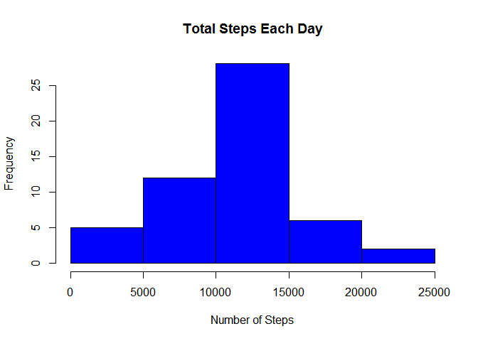
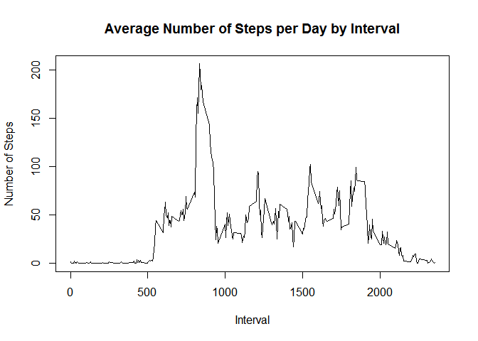
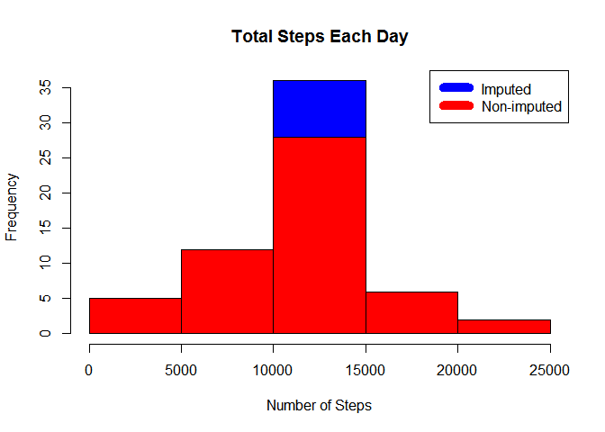
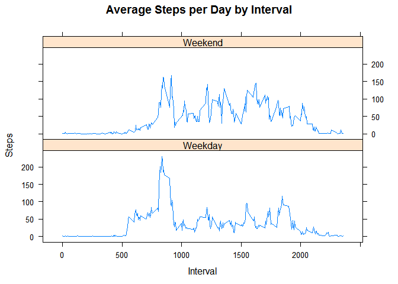

# Reproducible Research: Peer Assessment 1


## Loading and preprocessing the data

```r
setwd("C:/Users/Farzad/Dropbox/Data Science Toolbox/RepData_PeerAssessment1")
D = read.csv("activity.csv",header = TRUE, sep = ",")
```

## What is mean total number of steps taken per day?

```r
stepsbyday <- aggregate(steps ~ date, D, sum)
hist(stepsbyday$steps, main = paste("Total Steps Each Day"), col="blue", xlab="Number of Steps")
```



```r
rmean <- mean(stepsbyday$steps)
rmedian <- median(stepsbyday$steps)
```
## What is the average daily activity pattern?

```r
stepsbyinterval <- aggregate(steps ~ interval, D, mean)

plot(stepsbyinterval$interval,stepsbyinterval$steps, type="l", xlab="Interval", ylab="Number of Steps",main="Average Number of Steps per Day by Interval")
```



```r
maxinterval <- stepsbyinterval[which.max(stepsbyinterval$steps),1]
```


## Imputing missing values

```r
incomplete <- sum(!complete.cases(D))
imputedD <- transform(D, steps = ifelse(is.na(D$steps), stepsbyinterval$steps[match(D$interval, stepsbyinterval$interval)], D$steps))

stepsbydayi <- aggregate(steps ~ date, imputedD, sum)
hist(stepsbydayi$steps, main = paste("Total Steps Each Day"), col="blue", xlab="Number of Steps")

#Create Histogram to show difference. 
hist(stepsbyday$steps, main = paste("Total Steps Each Day"), col="red", xlab="Number of Steps", add=T)
legend("topright", c("Imputed", "Non-imputed"), col=c("blue", "red"), lwd=10)
```



```r
rmean.i <- mean(stepsbydayi$steps)
rmedian.i <- median(stepsbydayi$steps)
meandiff <- rmean.i - rmean
meddiff <- rmedian.i - rmedian
totaldiff <- sum(stepsbydayi$steps) - sum(stepsbyday$steps)
```
## Are there differences in activity patterns between weekdays and weekends?

```r
weekdays <- c("Monday", "Tuesday", "Wednesday", "Thursday", "Friday")
imputedD$dow = as.factor(ifelse(is.element(weekdays(as.Date(imputedD$date)),weekdays), "Weekday", "Weekend"))

stepsbyintervali <- aggregate(steps ~ interval + dow, imputedD, mean)

library(lattice)

xyplot(stepsbyintervali$steps ~ stepsbyintervali$interval|stepsbyintervali$dow, main="Average Steps per Day by Interval",xlab="Interval", ylab="Steps",layout=c(1,2), type="l")
```


